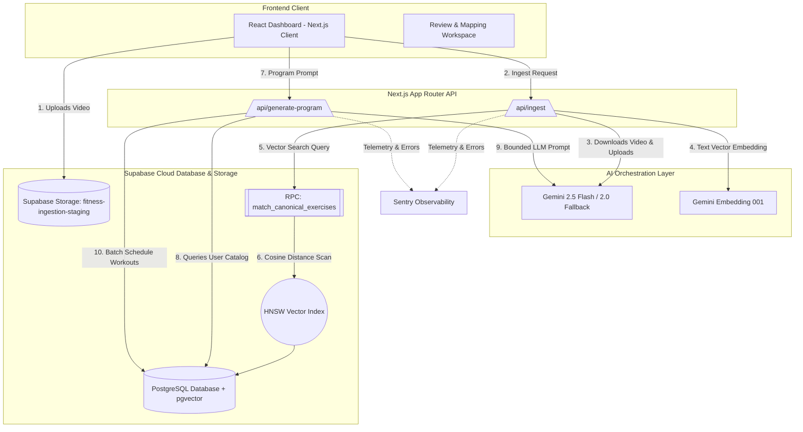
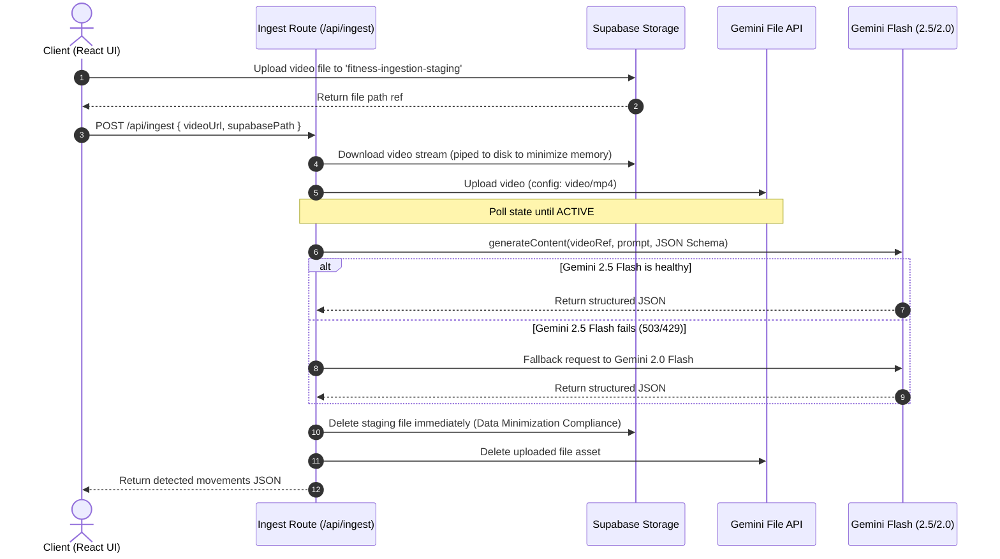
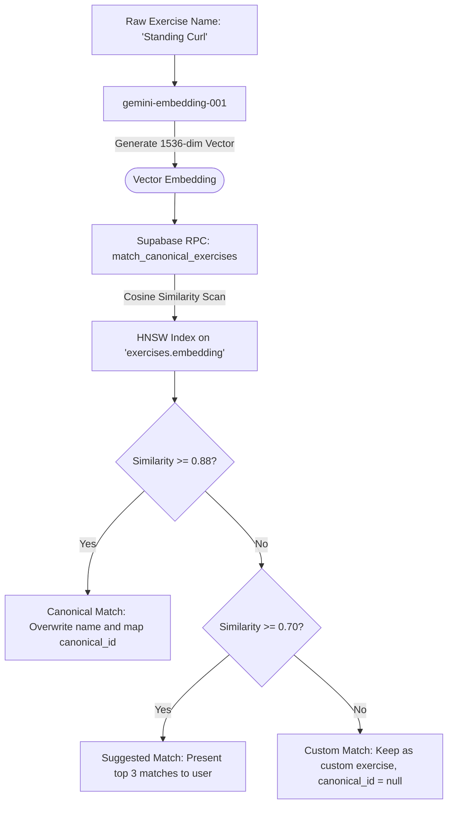
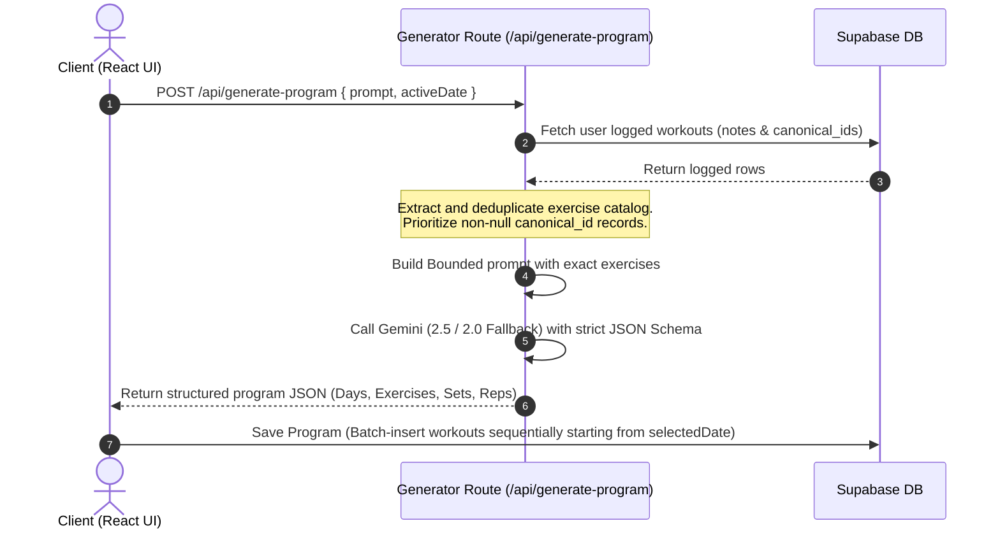
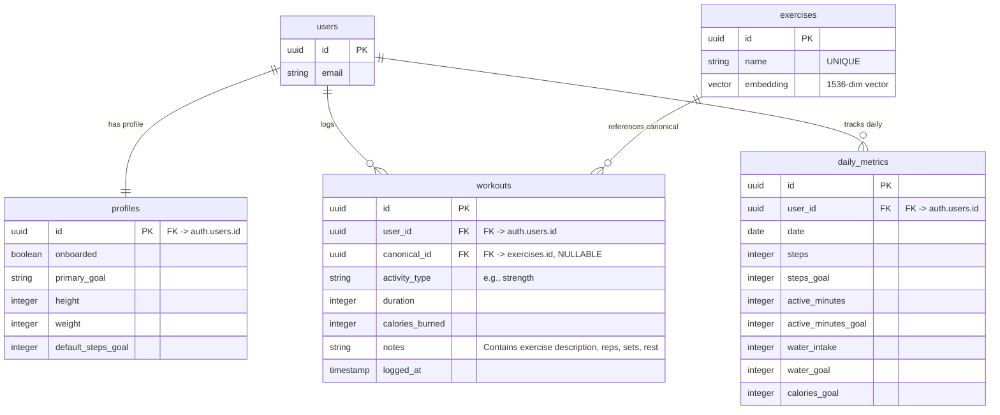

# FitFirst: System Architecture & Technical Proof of Work

Welcome to the technical architecture guide for **FitFirst**, an AI-driven Fitness Content Intelligence platform. This document is designed for developers, system architects, and technical recruiters to showcase how FitFirst solves complex engineering challenges—such as multimodal video analysis, vector similarity matching, database normalization, and LLM orchestration—using a production-grade, serverless stack.

---

## 🏗 High-Level Architecture Overview

FitFirst is built using a modern, type-safe serverless architecture. It enables users to upload exercise videos, automatically extract movement data using multimodal models, match extracted movements against a canonical exercise database using vector search, and generate custom training programs constrained to their personal exercise catalog.



---

## 🛠 Technology Stack

* **Frontend & Serverless Framework**: Next.js 16 (App Router) + React 19 + TypeScript
* **Styling & UI**: Tailwind CSS (Glassmorphic design system, high-contrast layouts)
* **Backend Database & Storage**: Supabase (PostgreSQL 15+ with the `pgvector` extension)
* **AI & Machine Learning**:
  * `@google/genai` SDK
  * **Multimodal Analysis & Reasoning**: `gemini-2.5-flash` (Primary) with automatic fallback to `gemini-2.0-flash`
  * **Vector Embeddings**: `gemini-embedding-001` (1536-dimensional output)
* **Observability & Error Tracking**: Sentry (fully instrumented via `Sentry.captureException`)

---

## ⚡️ Detailed Core Subsystems

### 1. Multimodal Video Ingestion Pipeline
When a user uploads a workout video, the system extracts the exact exercises, timestamps, and muscle mappings:



#### Key Architecture Decisions:
* **Memory Optimization**: The video is piped directly from Supabase Storage to the local serverless disk (`scratch/`) using Node.js streams (`pipeline`), avoiding loading large video buffers into RAM.
* **Resiliency Fallback Chain**: If the primary `gemini-2.5-flash` model fails or encounters a `503 High Demand` or `429 Quota limit` error on the free tier, it automatically catches the exception and falls back to `gemini-2.0-flash`.
* **Privacy & GDPR Compliance**: Ingestion staging files are deleted immediately after the pipeline finishes executing, ensuring zero-residual data retention on staging.

---

### 2. Vector Normalization Engine
Raw exercise names extracted by the vision model can vary (e.g., "Standing Curl", "Barbell Bicep Curl", "Biceps Curl"). The Vector Normalization Engine resolves these raw names to canonical exercise records stored in the database.



#### SQL Implementation: Stored Procedure & Indexing
To support high-performance similarity queries, PostgreSQL utilizes the `pgvector` extension, an HNSW (Hierarchical Navigable Small World) index for approximate nearest neighbors, and a cosine distance search RPC function:

```sql
-- 1. Enable pgvector extension
CREATE EXTENSION IF NOT EXISTS vector;

-- 2. Exercises schema with 1536-dimensional embedding
CREATE TABLE public.exercises (
    id UUID PRIMARY KEY DEFAULT gen_random_uuid(),
    name TEXT NOT NULL UNIQUE,
    embedding vector(1536),
    created_at TIMESTAMP WITH TIME ZONE DEFAULT timezone('utc'::text, now()) NOT NULL
);

-- 3. HNSW Index for rapid cosine distance calculations
CREATE INDEX ON public.exercises 
USING hnsw (embedding vector_cosine_ops);

-- 4. Cosine Similarity RPC Procedure
CREATE OR REPLACE FUNCTION match_canonical_exercises (
  query_embedding vector(1536),
  match_threshold float,
  match_count int
)
RETURNS TABLE (
  id uuid,
  name text,
  similarity float
)
LANGUAGE plpgsql TO authenticated AS $$
BEGIN
  RETURN QUERY
  SELECT
    exercises.id,
    exercises.name,
    1 - (exercises.embedding <=> query_embedding) AS similarity
  FROM exercises
  WHERE 1 - (exercises.embedding <=> query_embedding) > match_threshold
  ORDER BY exercises.embedding <=> query_embedding ASC
  LIMIT match_count;
END;
$$;
```

---

### 3. AI Workout Generator Engine
The Workout Generator designs structured routines that are strictly bounded to the user's personal exercise history.



#### Deduplication & Mapping Strategy
The generator reads the user's logged workouts, parsing exercise names from raw strings. It uses a `Map` structure to deduplicate exercise names:
* If the user previously performed a movement that has since been normalized to a canonical ID, the catalog extractor automatically upgrades duplicate entries to prioritize the non-null `canonical_id`.
* This guarantees that the generator maps correct canonical links to Gemini, while still preserving custom workouts (`canonical_id: null`).

---

## 🗄 Database Schema Design



---

## 🚀 Key Recruiter & Engineering Takeaways

* **Serverless Multimodal Processing**: Orchestrates heavy video analysis workflows serverlessly using the Gemini File API and Flash models, keeping the Next.js runtime lightweight.
* **Production-Grade Resiliency**: Includes multi-model fallback routines (`gemini-2.5-flash` $\to$ `gemini-2.0-flash` $\to$ local mock data) preventing rate limits or service unavailability from breaking the user experience.
* **Vector Cosine Similarity & pgvector**: Implemented database-level similarity search using cosine distance algorithms and HNSW indexing, avoiding expensive third-party vector databases.
* **Strict Type Safety**: Generates TypeScript database bindings dynamically from the live database schema (via Supabase CLI / custom scripts) and enforces TypeScript typing throughout the API and client components.
* **Full Sentry Observability**: All DB mutations and third-party API routes are monitored. Errors are captured using Sentry to ensure fast troubleshooting in production.
